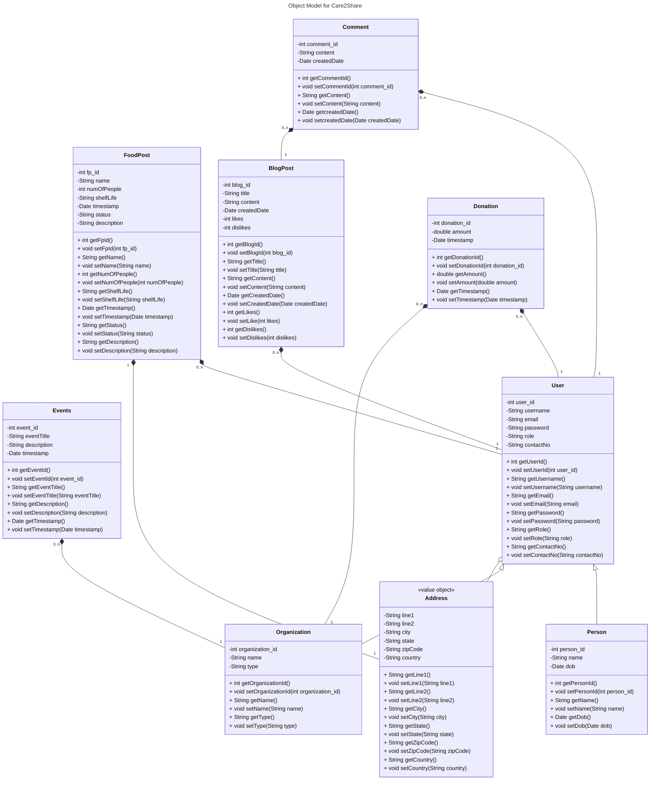

# Care2Share
## Description:
Welcome to 'Care2Share', an innovative web application dedicated to combating food scarcity and hunger on a global scale. Our platform serves as a dynamic hub where individuals, organizations, and NGOs come together to share and collect surplus food, organize events, donate resources, and raise awareness about pressing issues surrounding hunger relief. With a focus on community engagement and collaboration, Care2Share empowers users to make a meaningful impact in the fight against hunger."
 
## Key Features:
 
1. User Authentication and Profiles:
 
Users can sign up as individuals or organizations, such as a person, hotels, restaurants, and NGOs.
Each user has a personalized profile to manage their activities on the platform.
 
2. Surplus Food Sharing:
 
Individuals or businesses can post surplus food listings, specifying the location and the number of people it can feed.
NGOs can search for available food listings based on location and place orders for pickup.
 
3. Donation Platform:
 
Users can make monetary donations to NGOs through integrated payment gateways, supporting their hunger relief campaigns.
 
4. Event Management:
 
NGOs can create and publish events for food distribution, allowing users to volunteer and participate in community initiatives.
Users can search for events based on location and volunteer to contribute their time and resources.
 
5. Blogging and Awareness Campaigns:
 
Users can publish blogs addressing food scarcity and hunger relief, sharing insights, experiences, and solutions.
The platform facilitates user engagement through likes and comments to amplify awareness efforts.
 
6. Email Notifications & Map Functionality:
 Users receive email notifications after creating Foodposts. NGO users get email notifications after booking the food post with map locations which leverages Google Map API and EmailJS.

## Object Model

## Contributors

- Yugal Bharat Lakhyani: lakhyani.y@northeastern.edu
- Anup Balasaheb Pote: pote.a@northeastern.edu
- Sayantika Pal: pal.sayan@northeastern.edu
- Jayanti Hari: lnu.jay@northeastern.edu
